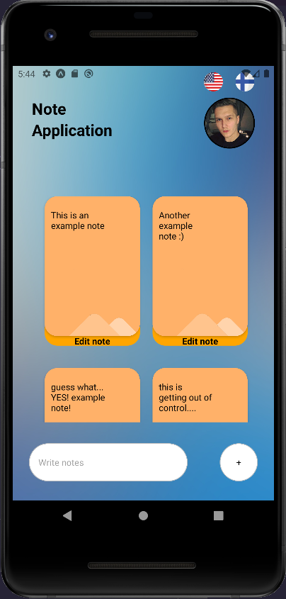

*Note application*

- Save notes 
- Delete notes 
- Notes get stored locally via AsyncStorage (Dont need encrypting here)
- Language support for fin/eng
- Made to be as simple as possible (just like me :D)

Watch a video demonstration of this application here: https://streamable.com/9p09uz

*Things that need improving in this app*

- Codebase a bit messy and there is spaghettish code here and there. Needs rework. Maybe a separate utility file that contains the most used functions. 
- Filestructure needs to be more organized. (Just done this way to save time as this was a project for school)
- Some things are accomplished somewhat stupidly in the app. Need to clean those functions up. 

# Picture of the application UI

